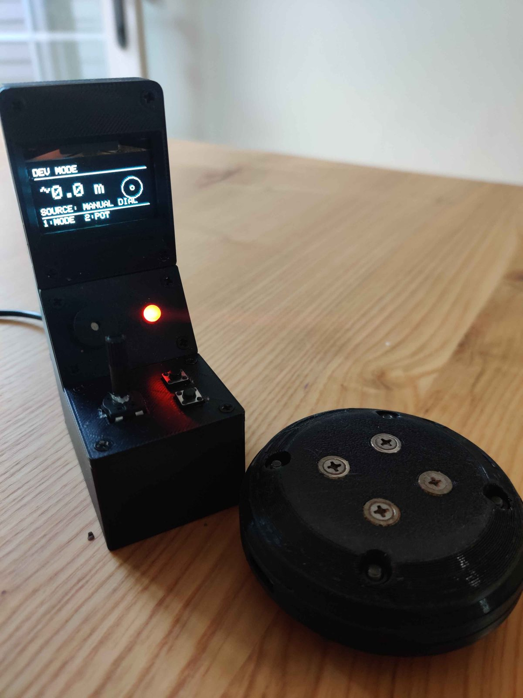
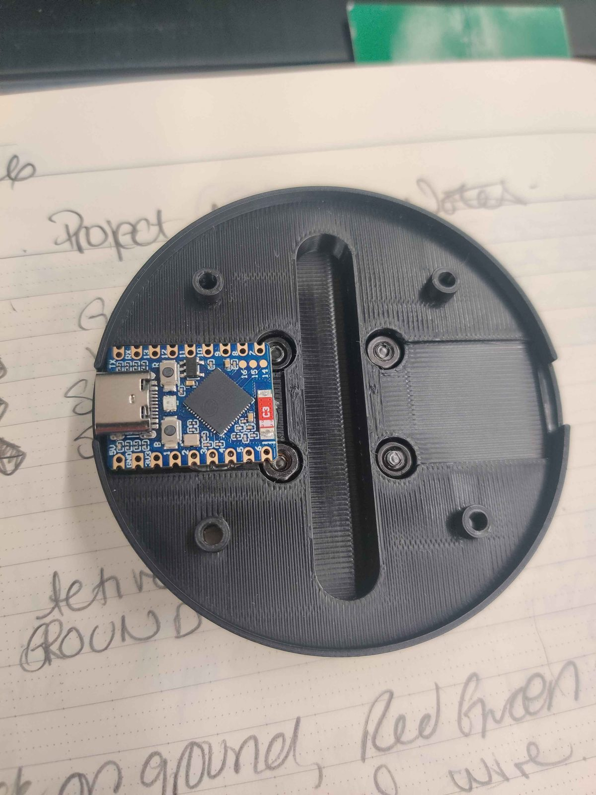
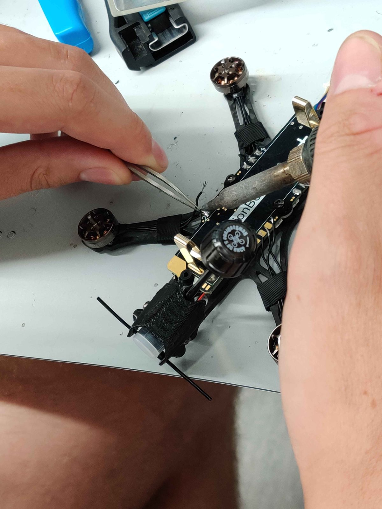
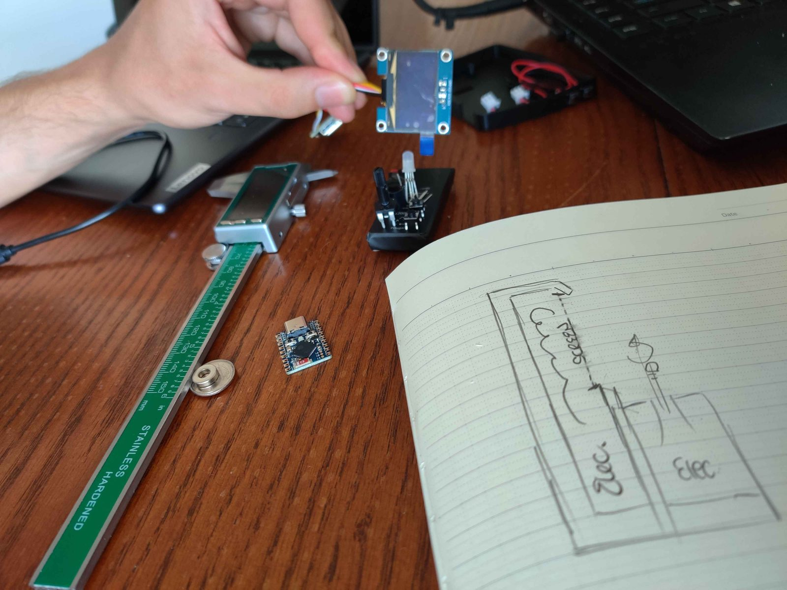

# Skygames

Hide and seek played with an FPV drone. A puck gets hidden somewhere in the play
area, the pilot flies out to find it, and a handheld controller gets warmer or
colder (more frequent beeps/less frequent beeps) as the drone closes in.



## How the game works

Three boards, one job each.

The **puck** broadcasts a small beacon packet about ten times a second. That is
its only job - it never listens for anything.

The **drone** is the seeker. It hears the beacon, reads the signal strength of
each packet as it arrives, filters it, and buckets the result into NEAR / MID /
FAR / LOST. It relays that zone to the controller about ten times a second.

The **controller** plays the zone back to the pilot on a buzzer and an RGB LED.
No RSSI math happens there.

The sensing sits on the drone on purpose: the drone is the one flying around the
puck, so it has to be the one sensing proximity. A controller sitting still on
the ground would be measuring the pilot's distance instead, which is not the
number anyone wants.

## Signal strength, not GPS

The first design has the puck and the drone both reporting GPS positions, with
the controller working out the distance between them. It does not hold up
indoors: the M10Q cannot keep a fix inside a building, and the system has to
work indoors and out. Signal strength needs no satellites. It is noisy, but it
moves in the right direction, and that is enough for hot-and-cold.

GPS keeps one job - **follow home**, where the drone measures against its own
launch point instead of against the puck. That distance is big enough for GPS to
be good at it, and it is an outdoor feature anyway.



## Feedback

The buzzer is an active one, so it has a fixed pitch and can only be switched on
and off - it cannot be pitch-shifted by driving the pin at different
frequencies. Proximity is carried by beep rate instead: faster clicks as you get
closer. It runs through PWM rather than a plain digital write so the volume can
be turned down, which it needed.

The RGB LED is PWM-driven too, so colour is a real gradient rather than a few
fixed hues: green close, red far, blending through yellow between, off when the
signal is lost. It blinks in sync with the buzzer.

Two buttons. **Mode** toggles between follow-puck and follow-home. **Pot
toggle** switches the potentiometer dial in and out of the loop - the dial is a
bench override that feeds a manual distance in place of live sensing.

## Repository layout

```
src/controller/        the handheld unit - display, buzzer, RGB LED, buttons
src/esp_now_gps_tx/    the drone - GPS fix, RSSI sensing, relays both
src/puck_gps_tx/       the puck - beacon broadcaster
src/experiments/       bench sketches, one per component (see its README)
models/                FreeCAD enclosures for the puck and the controller
docs/                  photos
```

Those three sketches stand in for eleven. Every component gets proved on its own
first - a sketch that only blinks an LED over the radio, one that only parses
GPS, one that only drives the screen - and the working parts fold into three
programs that talk to each other. The originals stay in `src/experiments/`, both
as a record and because several are still the quickest way to test a board you
have just soldered.

`puck_gps_tx` keeps its name from when the puck still carried GPS. The name is
wrong, but the history is easier to follow with it left alone.

## Hardware

| Part | Board |
|---|---|
| Controller | ESP32-C6 Pico |
| Drone | ESP32-C3 |
| Puck | ESP32-C3 |

| Peripheral | Notes |
|---|---|
| SH1106 OLED | I2C, driven through Adafruit GFX and SH110X |
| M10Q GPS module | UART, parsed with TinyGPS++ |
| Active piezo buzzer | Fixed pitch, so feedback is by rate |
| Common-cathode RGB LED | PWM, continuous green-to-red gradient |
| Momentary pushbuttons | Mode, and the dial override |
| Potentiometer | Bench override for manual distance |
| 18650 cell + TP4056 | Power and USB-C charging |

Controller wiring, confirmed against the built unit:

```
OLED (I2C)        SDA 22, SCL 23
Buttons           mode 2, pot toggle 3
Buzzer            18
RGB LED           19 / 20 / 21
Potentiometer     0
```

On the drone, the GPS module's TX line goes to GPIO20. It is a passive tap - the
sketch passes -1 for its own TX pin, so it can never drive the wire it is
reading.

## Flashing

Arduino IDE with the `esp32` boards package by Espressif, version 3.x. Pick
**ESP32C6 Dev Module** for the controller and **ESP32C3 Dev Module** for the
drone and the puck. Enable *USB CDC On Boot* on all three - these boards have no
USB-to-serial chip, so that is what makes Serial work over the native USB-C
port.

Libraries: **TinyGPSPlus** by Mikal Hart (not the older `TinyGPS`, which has a
different API), **Adafruit GFX**, **Adafruit SH110X**.

All three boards need to be locked to the same WiFi channel - see
`WIFI_CHANNEL` in each sketch. RSSI readings only compare within a channel, and
the link is only reliable when the radios agree on one.



## Enclosures

`models/` holds the FreeCAD sources for the puck and controller housings. No
mesh exports yet, so printing one means opening FreeCAD for now.

## Known rough edges

The boards address each other by **broadcast**, not by paired MAC. It works with
no setup, and it also means a board picks up beacons from any other Skygames
puck in range. Each sketch prints its own MAC on boot, so swapping in real peer
addresses is a small change when it matters.

The controller's **screen is a placeholder** - a plain status readout, not a
designed interface. The "set puck" screen in `src/experiments/ui_test` is where
that was heading.

The **potentiometer has a worn track** and jumps on its own occasionally - it
came out of a school kit and has had a previous life. That is why there is a
button to shut the dial out of the loop entirely.

## Next

**More game modes** - capture the flag, push the cart - on the same telemetry
and RSSI foundation. Game logic is centralised on the controller, so a new mode
needs no drone firmware change. That is most of why it is built that way.

**A drone-agnostic mount** around the 1S/18650 power system consumer
micro-drones already use, so the electronics bolt onto a drone somebody already
owns instead of needing a custom build.

**Better-sounding audio cues** for players, so a bare buzzer is not the only
thing to listen to.

**Peer MACs and a designed screen**, both from the rough edges above.



## Credits

Built with Brayden ([@braybuch](https://github.com/braybuch)) for ENL 4003.
Brayden handled hardware selection, bench testing and enclosure work, and wrote
the original proximity finder the whole signal-strength approach comes out of.

## Licence

MIT - see [LICENSE](LICENSE).
